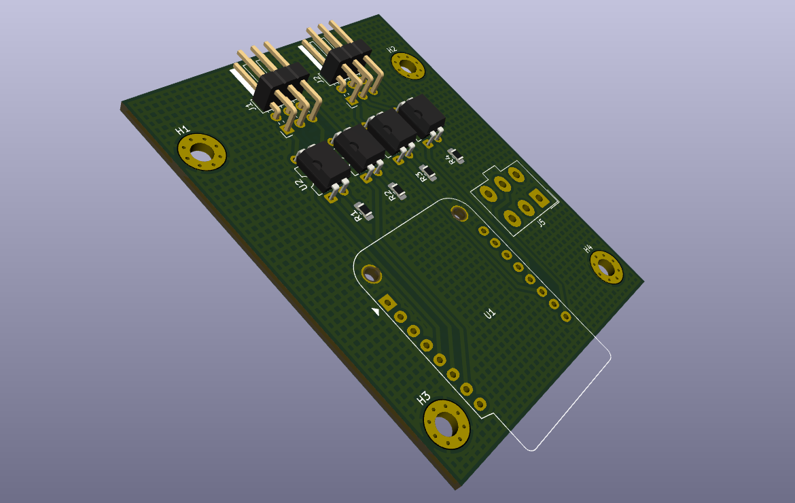
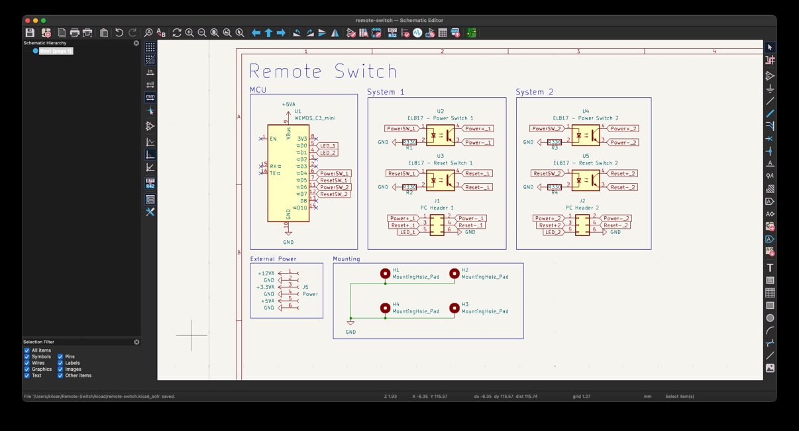
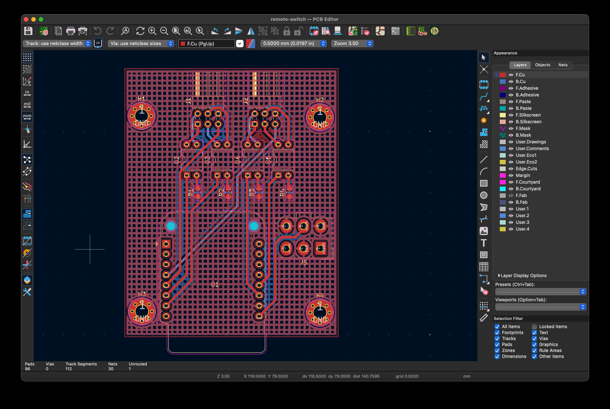

  <h1 align="center">Remote Switch</h1>

  

  

  <a href="https://blueprint.hackclub.com/">
    </img>
  </a>
  

  <h1></h1>
  

    Turn on Devices without touching them. Simple but yet efficient!
  

This work is licensed under the
[MIT License](https://mit-license.org).

## Table of Contents

- [About](#about)
- [Pictures](#pictures)
- [Bill of Materials](#bill-of-materials)

# About

I need a way to turn the PCs in my rack on and off, ideally centrally and via Wi-Fi. My idea is to use simple optocouplers to simulate the power button and control it with a microcontroller, just like the reset function. The positive LED output will then simply be connected to a GPIO pin of the MCU, allowing it to see whether the PC is on or off. Thats it!

# Pictures

# Bill of Materials

<strong>Show Bill Of Materials(BOM) ----></strong>

|Designator    |Footprint                                       |Quantity|Value                 |LCSC Part #|
|--------------|------------------------------------------------|--------|----------------------|-----------|
|J1            |PinHeader_2x03_P2.54mm_Horizontal               |1       |PC Header 1           |C41417351  |
|J2            |PinHeader_2x03_P2.54mm_Horizontal               |1       |PC Header 2           |C41417351  |
|J5            |Molex_Mini-Fit_Jr_5566-06A_2x03_P4.20mm_Vertical|1       |Power                 |C471417    |
|R1, R2, R3, R4|0805                                            |4       |R330                  |C17630     |
|U1            |WEMOS_C3_mini                                   |1       |WEMOS_C3_mini         |           |
|U2            |DIP-4_W7.62mm                                   |1       |EL817 - Power Switch 1|C5353      |
|U3            |DIP-4_W7.62mm                                   |1       |EL817 - Reset Switch 1|C5353      |
|U4            |DIP-4_W7.62mm                                   |1       |EL817 - Power Switch 2|C5353      |
|U5            |DIP-4_W7.62mm                                   |1       |EL817 - Reset Switch 2|C5353      |
|LCSC Quote: 14.32 Dollar      |                                                |        |                      |           |
|JLCPCB Quote: 6.54 Dollar     |                                                |        |                      |           |
|Aliexpress Quote: 5.69 Dollar |                                                |        |                      |           |
|All together: 26.55 Dollar    |                                                |        |                      |           |

